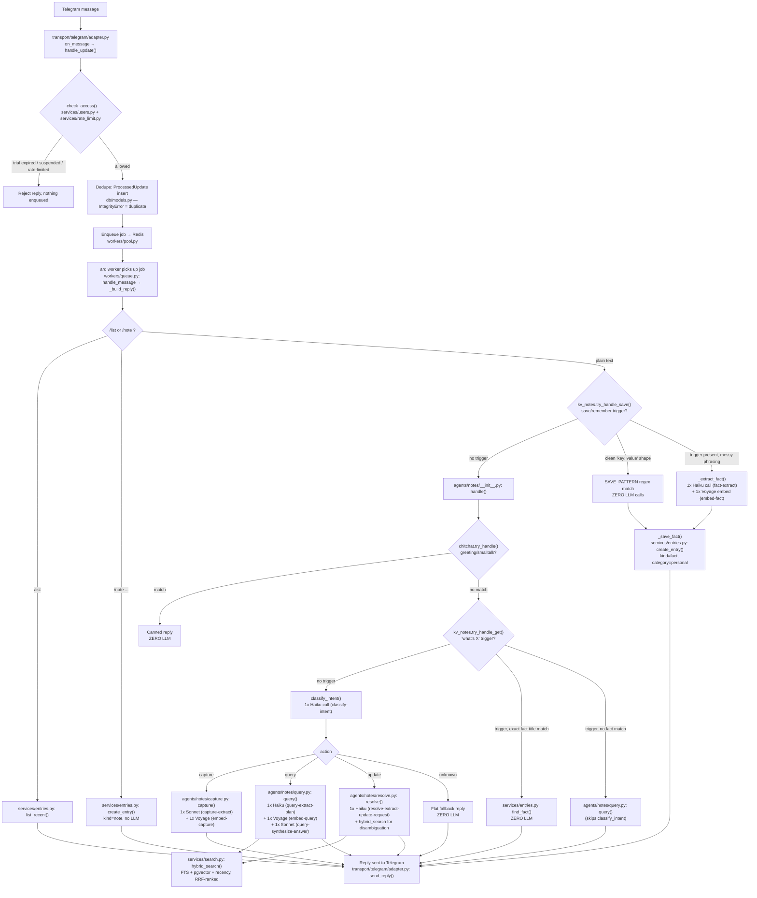

# Request → Answer flow: what's sitting where

Traces one Telegram message through the system end to end, in the order the code actually
runs today (not the HLD's original phase order — several zero-LLM fast paths have been added
since). For each stage: which file/function owns it, and whether it costs an LLM/embedding
call or not.

## Diagram

## Stage-by-stage table

| # | Stage | File : function | LLM / embed calls |
|---|---|---|---|
| 1 | Receive message | `transport/telegram/adapter.py:on_message` | — |
| 2 | Access control (trial/suspended/rate-limit) | `transport/telegram/adapter.py:_check_access` → `services/users.py`, `services/rate_limit.py` | — |
| 3 | Dedupe | `transport/telegram/adapter.py:handle_update` → `db/models.py:ProcessedUpdate` | — |
| 4 | Enqueue | `workers/pool.py` (Redis via arq) | — |
| 5 | `/list`, `/note` | `workers/queue.py:_build_reply` → `services/entries.py` | — |
| 6a | Save a fact, clean syntax ("save X: Y") | `services/kv_notes.py:try_handle_save` → `SAVE_PATTERN` regex | **zero** |
| 6b | Save a fact, messy phrasing (trigger word present, no clean separator) | `services/kv_notes.py:_extract_fact` | 1x Haiku (`fact-extract`) + 1x Voyage (`embed-fact`) |
| 7 | Greeting / small talk ("hi", "are you alive") | `services/chitchat.py:try_handle` | **zero** |
| 8a | "what's X" — exact fact match | `services/kv_notes.py:try_handle_get` → `services/entries.py:find_fact` | **zero** |
| 8b | "what's X" — no fact match | `agents/notes/query.py:query` (classify_intent skipped) | see row 10 |
| 9 | Intent classification (everything else) | `agents/notes/__init__.py:classify_intent` | 1x Haiku (`classify-intent`) |
| 10a | capture | `agents/notes/capture.py:capture` | 1x Sonnet (`capture-extract`) + 1x Voyage (`embed-capture`) |
| 10b | query | `agents/notes/query.py:query` | 1x Haiku (`query-extract-plan`) + 1x Voyage (`embed-query`) + 1x Sonnet (`query-synthesize-answer`) |
| 10c | update | `agents/notes/resolve.py:resolve` | 1x Haiku (`resolve-extract-update-request`) |
| 10d | unknown (not caught by chitchat) | flat fallback string | **zero** |
| 11 | Search (used by query + update) | `services/search.py:hybrid_search` | — (reads embeddings already computed) |
| 12 | Send reply | `transport/telegram/adapter.py:send_reply` | — |

## Where storage actually lives

- **`entries` table** (`db/models.py:Entry`) — the single store for everything: notes, tasks,
  *and* facts (`EntryKind.fact`, added this session — `user_kv_notes` no longer exists).
  `services/entries.py` is the only writer (D5).
- **`usage_records`** — every LLM/embed call in the table above writes one row here
  (`services/usage.py`), which is how the "zero calls" claims above are actually verified,
  not just asserted.
- **Redis** — the arq job queue (`workers/pool.py`) and rate-limit counters
  (`services/rate_limit.py`); nothing durable.

## Reading this against the context-engineering doc

Rows 6a, 7, and 8a are the fast paths added this session specifically to avoid paying stage
9's fixed classify-intent overhead (Module 1's "fixed overhead dwarfs user content" point) for
message shapes that are cheap to recognize deterministically. Everything that reaches stage 9
still pays the full multi-call pipeline described in `context-engineering-learning-path.md` —
those fast paths reduce *how often* you reach that pipeline, not its per-call cost; Modules
2-6 of that doc are what shrink the pipeline itself.
